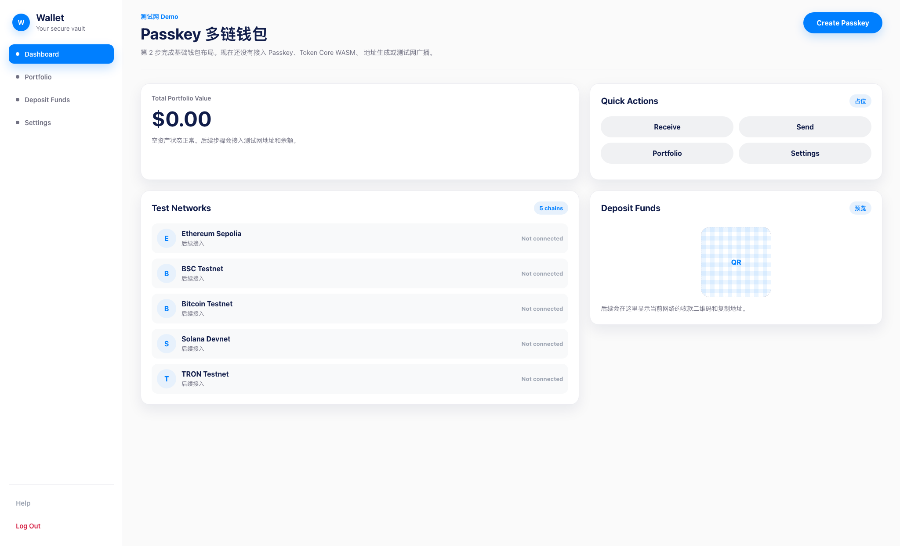

# Step 02 Screenshot

## 内容

本记录对应 `implementation-plan.md` 的第 2 步：接入设计系统方向的基础布局。

当前页面已经包含：

- 左侧导航：Dashboard、Portfolio、Deposit Funds、Settings。
- 顶部标题：Passkey 多链钱包。
- 主按钮：Create Passkey。
- 主内容区：Total Portfolio Value、Quick Actions、Test Networks、Deposit Funds。
- 五条测试网占位：Ethereum Sepolia、BSC Testnet、Bitcoin Testnet、Solana Devnet、TRON Testnet。

当前页面仍然只是静态布局，不包含真实 Passkey、Token Core WASM、地址生成、余额查询或测试网广播功能。

## 截图

## 验证

已验证：

- `npm run build`
- `npm run typecheck`
- `make lint`
- 本地浏览器访问 `http://127.0.0.1:5174/`

