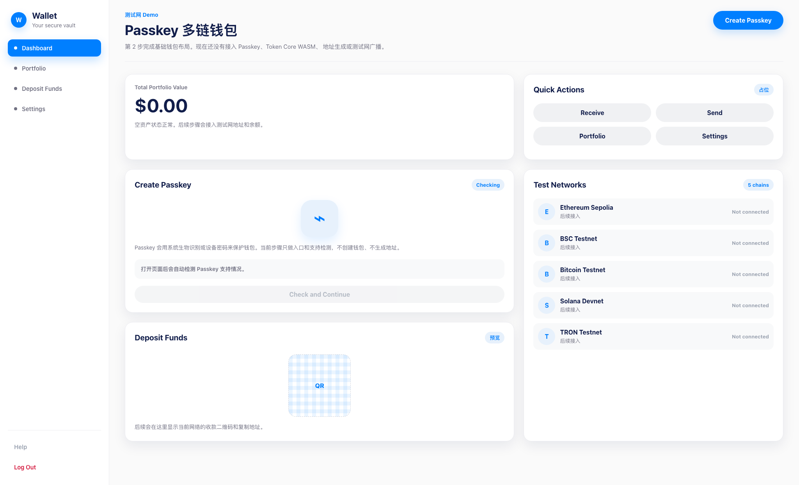

# Step 03 Screenshot

## 内容

本记录对应 `implementation-plan.md` 的第 3 步：创建 Passkey 页面。

当前页面已经包含：

- `Create Passkey` 顶部入口。
- 独立的 `Create Passkey` 面板。
- 浏览器 Passkey 支持检测。
- 支持状态标签：`Checking`、`Supported` 或 `Unsupported`。
- 不支持 Passkey 时禁用继续按钮。
- 明确提示当前步骤不创建钱包、不生成地址、不接入签名。

## 截图

## 验证

已验证：

- `npm run build`
- `npm run typecheck`
- `make lint`
- 本地浏览器访问 `http://127.0.0.1:5174/MyWallet/`
- Playwright 页面快照中可以看到 `Create Passkey` 面板和 Passkey 支持状态

