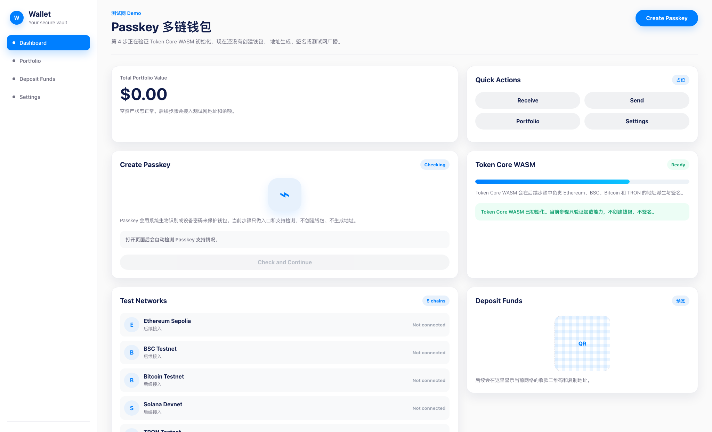

# Step 04 Screenshot

## 内容

本记录对应 `implementation-plan.md` 的第 4 步：初始化 Token Core WASM。

当前页面已经包含：

- `@consenlabs/tcx-wasm` 依赖。
- 页面加载时自动初始化 Token Core WASM。
- `Token Core WASM` 状态面板。
- 成功状态：`Ready`。
- 失败状态：显示初始化失败原因。
- 当前步骤仍然不创建钱包、不生成地址、不签名、不广播。

## 截图

## 验证

已验证：

- `npm run build`
- `npm run typecheck`
- 生产预览 `npm run preview -- --host 127.0.0.1 --port 4174`
- WASM 文件以 `application/wasm` 类型返回
- 页面 DOM 显示 `Token Core WASM` 状态为 `Ready`

