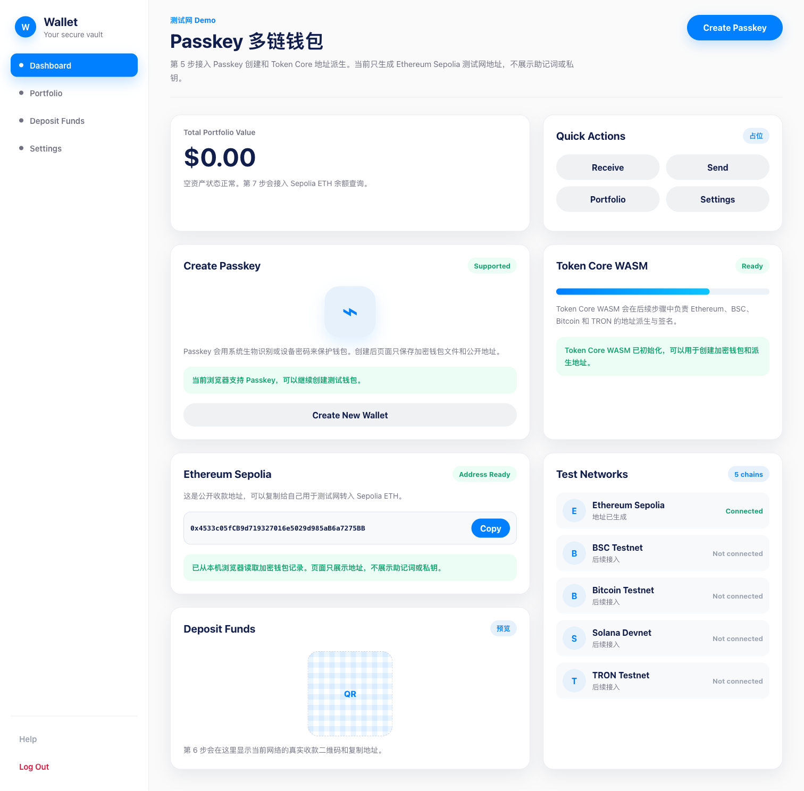

# 第 5 步截图记录：Ethereum Sepolia 测试钱包

## 本步目标

- 点击 `Create Passkey` 后创建 Passkey。
- 使用 Passkey PRF 密钥创建 Token Core 加密钱包。
- 派生并显示 Ethereum Sepolia 地址。
- 地址可以复制。
- 页面不显示助记词、私钥或 Passkey PRF 密钥。

## 完成内容

- 接入浏览器 Passkey 创建入口。
- 使用 `@consenlabs/tcx-wasm` 的 `create_keystore` 创建加密钱包。
- 使用 `derive_accounts` 派生 Ethereum Sepolia 地址。
- 页面新增 Ethereum Sepolia 地址卡片和复制按钮。
- 本地只保存加密钱包文件、Passkey 凭据标识、PRF 盐值和公开地址，不保存助记词、私钥或 PRF 密钥。

## 验证方式

- 已运行 `npm run typecheck`。
- 已运行 `npm run build`。
- 已在浏览器打开 `http://127.0.0.1:5174/MyWallet/`。
- 已确认页面能显示 Ethereum Sepolia 地址、Token Core WASM 状态为 `Ready`。

说明：自动截图使用本机浏览器的本地测试钱包记录来展示“已生成地址”状态。真实 Passkey 创建需要用户在自己的浏览器里点击按钮并完成系统验证。

## 截图

