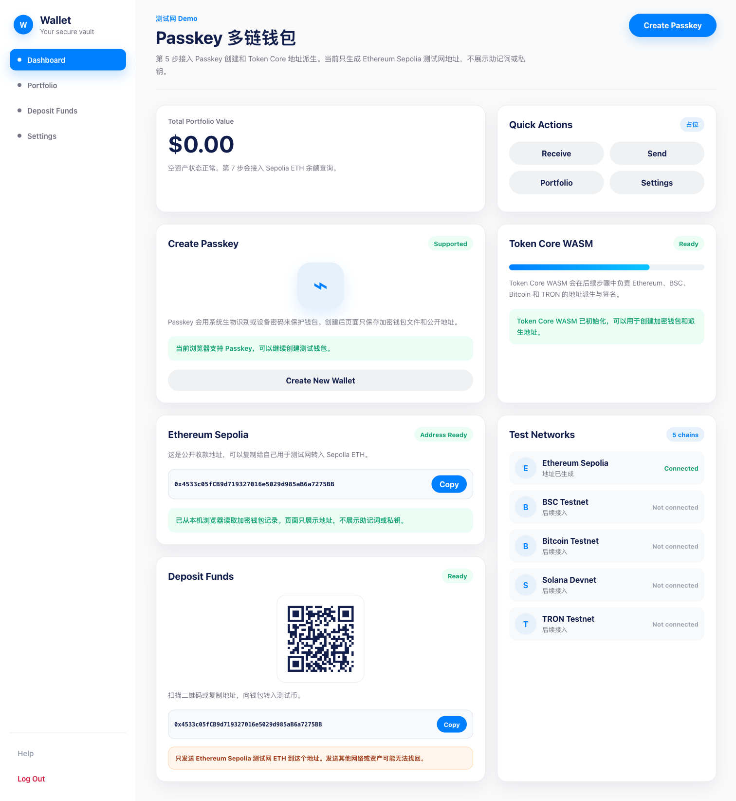

# 第 6 步截图记录：Deposit Funds 页面

## 本步目标

- 显示 Ethereum Sepolia 收款二维码。
- 显示 Ethereum Sepolia 地址。
- 提供复制按钮。
- 显示“只发送 Sepolia ETH”的提示。

## 完成内容

- 引入本地二维码生成库 `qrcode`。
- Deposit Funds 卡片会根据当前 Ethereum Sepolia 地址生成二维码。
- 二维码内容和页面展示地址使用同一个地址。
- 新增复制按钮和复制成功提示。
- 新增 Sepolia ETH 专属收款风险提示。

## 验证方式

- 已运行 `npm run typecheck`。
- 已运行 `npm run build`。
- 已在浏览器打开 `http://127.0.0.1:5174/MyWallet/`。
- 已确认二维码为本地生成的 `data:image/png`。
- 已确认页面显示地址、复制按钮和“只发送 Ethereum Sepolia 测试网 ETH”提示。

## 截图

